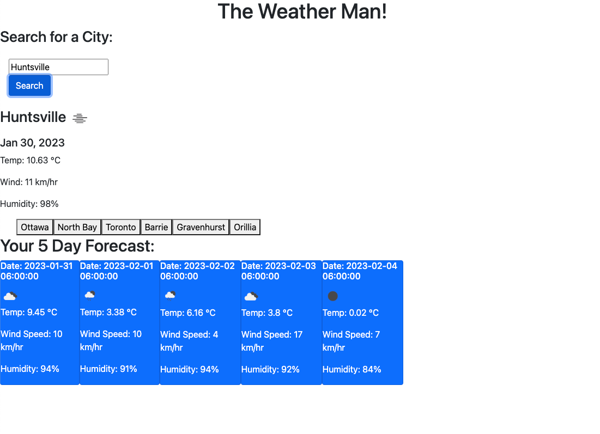

# theWeatherManForecast

## Description

This Weather Dashboard is for users looking to see the current and future weather for a city of their choice. This project is built to create easy access to users to see the 5 day forecast. It also offers simplicity as it will display your recent searches for easy access to view the weather again. The main goal is to provide an easy efficient weather dashboard for everyone to use. 

As an aspriring web developer I want to create a simple weather application that allows a user to see recent searches and see the current weather and the 5 day forecast for the specified location. 

## Installation 

N/A

## Usage

When I search for a city, then I am presented with current and future conditions for that city and that city is added to the search history. When I view current weather conditions for that city, then I am presented with the city name, the date, an icon representation of weather conditions, the temperature, the humidity, and the wind speed. When I view future weather conditions for that city, then I am presented with a 5-day forecast that displays the date, an icon representation of weather conditions, the temperature, the wind speed, and the humidity. When I click on a city in the search history then, I am again presented with current and future conditions for that city. 

## 

## Link 

https://cassiewatsonn.github.io/theWeatherManForecast/

## Credits 
Thank you to my study partner Rebecca Lawrence and all of the BCS helpers that helped me through multiple problems along the way!

## License

MIT License

Copyright (c) [2023]

Permission is hereby granted, free of charge, to any person obtaining a copy
of this software and associated documentation files (the "Software"), to deal
in the Software without restriction, including without limitation the rights
to use, copy, modify, merge, publish, distribute, sublicense, and/or sell
copies of the Software, and to permit persons to whom the Software is
furnished to do so, subject to the following conditions:

The above copyright notice and this permission notice shall be included in all
copies or substantial portions of the Software.

THE SOFTWARE IS PROVIDED "AS IS", WITHOUT WARRANTY OF ANY KIND, EXPRESS OR
IMPLIED, INCLUDING BUT NOT LIMITED TO THE WARRANTIES OF MERCHANTABILITY,
FITNESS FOR A PARTICULAR PURPOSE AND NONINFRINGEMENT. IN NO EVENT SHALL THE
AUTHORS OR COPYRIGHT HOLDERS BE LIABLE FOR ANY CLAIM, DAMAGES OR OTHER
LIABILITY, WHETHER IN AN ACTION OF CONTRACT, TORT OR OTHERWISE, ARISING FROM,
OUT OF OR IN CONNECTION WITH THE SOFTWARE OR THE USE OR OTHER DEALINGS IN THE
SOFTWARE.